<div align="center">

# S H A D O W

### _Face what you've been avoiding._

A dark, private app for shadow work: the Jungian practice of turning toward the parts of yourself you buried.

**No accounts. No cloud. No one watching.**

**[Enter the shadow →](https://shadow-work-app.netlify.app)**

<br />

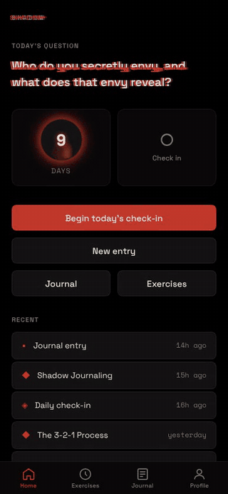

<br />
<br />

</div>

---

> _"One does not become enlightened by imagining figures of light,
> but by making the darkness conscious."_
>
> — C. G. Jung, _Alchemical Studies_

---

## You have a shadow

There's a version of you that you show the world, and there's everything you cut away to make that version possible.

The anger you were told was ugly. The grief nobody had room for. The ambition that felt like arrogance, the softness that felt like weakness, the wanting that felt like too much. You didn't destroy any of it. You just stopped looking at it.

It's still there. It shows up as the colleague you can't stand for no clear reason, the reaction that's three sizes too big for the moment, the same argument in a new relationship, the dream you keep having about the locked room under the house.

**Shadow work means turning around to look at it.** You aren't trying to fix it or kill it. You're trying to _meet_ it, and in doing so, get back the energy you've been spending to keep it hidden.

SHADOW is a place to do that, every day, in private.

<br />

<div align="center">
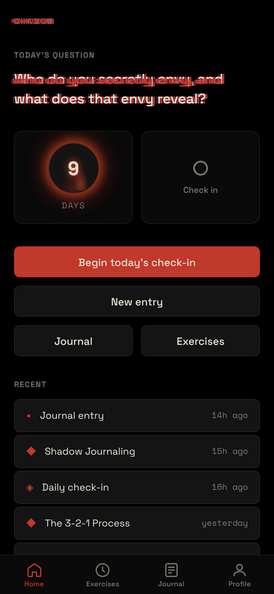
&nbsp;&nbsp;
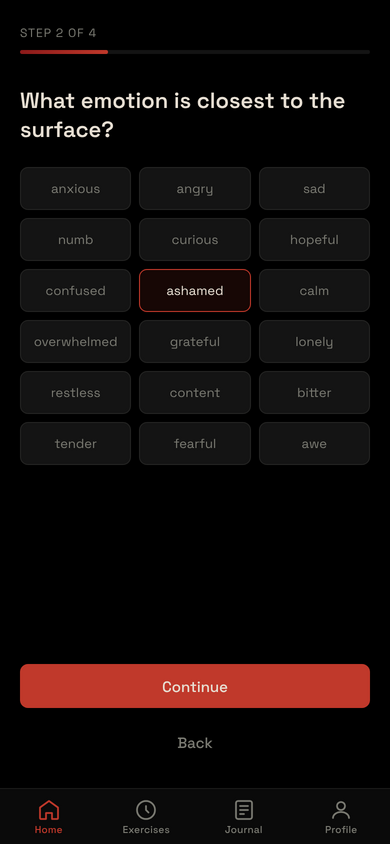
&nbsp;&nbsp;
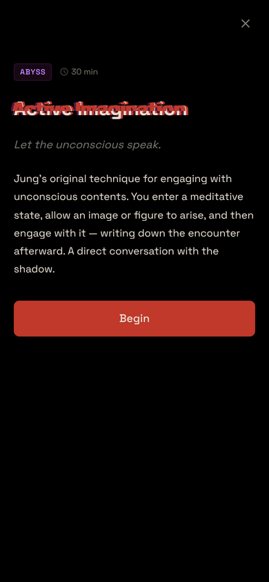
</div>

---

## A short history of the dark

### 1912–1917: a psychiatrist goes underground

After his break with Freud, **Carl Gustav Jung** went through what he later called his _"confrontation with the unconscious."_ For years he deliberately let fantasies, visions and inner figures rise up, then wrote down his conversations with them in a large red leather book. He was close to drowning in it at times. What he brought back out became the basis of analytical psychology, and that book, the **_Red Book_ (_Liber Novus_)**, stayed locked away until it was finally published in **2009**.

One of those ideas was the **shadow**: the part of the personality that the conscious ego refuses to identify with. It's the unlived, the denied, the disowned.

### The shadow isn't evil

Jung insisted that the shadow isn't just a cellar full of monsters. It also holds vitality, instinct, creativity and unrealised potential. Later writers named the positive side the **golden shadow**: the gifts you project onto people you admire because you can't yet claim them as your own.

> _"Everyone carries a shadow, and the less it is embodied in the individual's conscious life, the blacker and denser it is."_
> — Jung, _Psychology and Religion_ (1938)

### How you spot it: projection

The shadow rarely shows up directly. It shows up **out there**, in other people. Whatever we can't admit in ourselves, we see, magnify and condemn in someone else. That's why a strong, disproportionate reaction to another person is one of the most reliable doors into shadow work.

### Active imagination

During those underground years Jung also developed **active imagination**: you let an image or figure arise from the unconscious, then _engage it_ with full awareness. You talk to it, question it, and write down what it says. It's a dream you take part in while awake. It's still one of the deepest (and most demanding) techniques in the tradition.

### 1951: _Aion_

In _Aion_, Jung gave the shadow a formal chapter of its own and called it a _moral problem that challenges the whole ego-personality_. You can't become conscious of the shadow without real moral effort, because it means admitting that what you hate is partly you.

### The long bag we drag behind us

In the late 20th century the idea escaped the consulting room:

- **Marie-Louise von Franz**, Jung's close collaborator, spent decades on the shadow as it appears in fairy tales and dreams.
- **Robert Bly**'s _A Little Book on the Human Shadow_ (1988) gave the most famous image of it: a long invisible bag we drag behind us, which we spend the first half of life filling and the second half trying to empty.
- **Connie Zweig & Jeremiah Abrams** gathered dozens of writers, therapists and poets on the subject in _Meeting the Shadow_ (1991).
- **John Bradshaw** brought "inner child" work into the mainstream (_Homecoming_, 1990), echoing Jung's archetype of the divine child.
- **Louise Hay** popularised **mirror work**: looking yourself in the eye and saying what's true.
- **Ken Wilber** and colleagues distilled a fast, repeatable **3-2-1 Process**: face it (3rd person), talk to it (2nd person), be it (1st person).

### Now

Today "shadow work" is everywhere, from therapy rooms to journal prompts. Under all the noise the core practice hasn't changed: **notice the reaction, follow it inward, name what you find, and take it back.**

SHADOW is built on that lineage.

---

## What's inside

<div align="center">
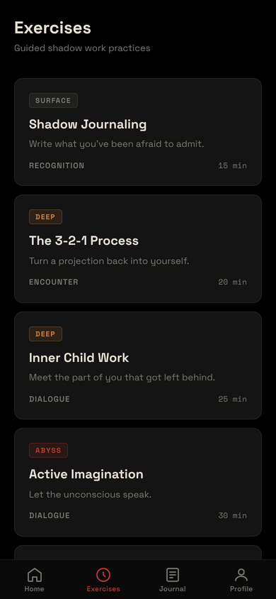
&nbsp;
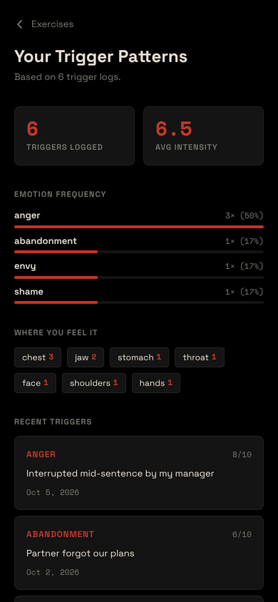
&nbsp;
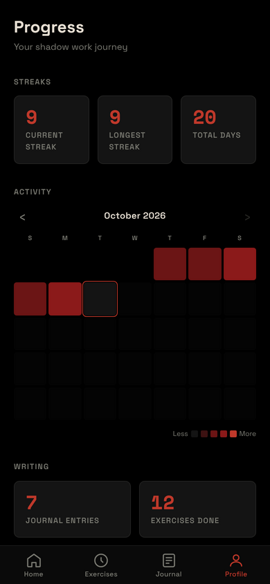
&nbsp;
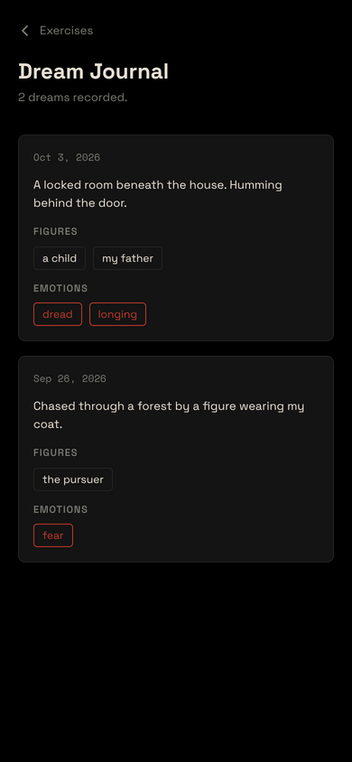
</div>

<br />

### ◈ Daily Check-In

A four-step ritual that takes a minute. **How present are you? What emotion sits closest to the surface? Did anything trigger you? What did you notice about yourself?** It's small on purpose, so that you keep coming back.

### ◆ Guided Exercises

Seven practices from the tradition, each sorted by how far down it goes:

| Depth       | Exercise           |                                              |
| :---------- | :----------------- | :------------------------------------------- |
| **Surface** | Shadow Journaling  | _Write what you've been afraid to admit._    |
| **Surface** | Trigger Tracking   | _Follow the reaction back to its root._      |
| **Deep**    | The 3-2-1 Process  | _Turn a projection back into yourself._      |
| **Deep**    | Inner Child Work   | _Meet the part of you that got left behind._ |
| **Deep**    | Mirror Work        | _Look yourself in the eye._                  |
| **Deep**    | Dream Work         | _Listen to what the night is telling you._   |
| **Abyss**   | Active Imagination | _Let the unconscious speak._                 |

Abyss-level exercises open with a safety check. A **grounding button** is always one tap away mid-exercise.

### ▪ Journal

Freeform writing, with prompts built to get things out of you that you didn't know were there. It autosaves as you type, and tags help you find the threads later.

### ☾ Dream Journal

Record the figures and emotions your unconscious sends you at night. Over time, the cast of characters begins to repeat.

### ⚡ Trigger Patterns

Log what sets you off, how hard it hit, and where you felt it in the body. SHADOW shows you the pattern: which emotions dominate, how intense they run, whether it's always the **jaw**, always the **chest**.

### ◎ Progress

Streaks, a calendar heatmap, and your movement through the four stages: **Recognition → Encounter → Dialogue → Integration.** It's there so you stay accountable, not to turn the work into a game.

### ✦ Learn

Short reads on the ideas underneath the practice: what the shadow is, how it forms, projection, the persona, the golden shadow, archetypes, and why the goal is _integration_, not elimination.

<div align="center">
<br />
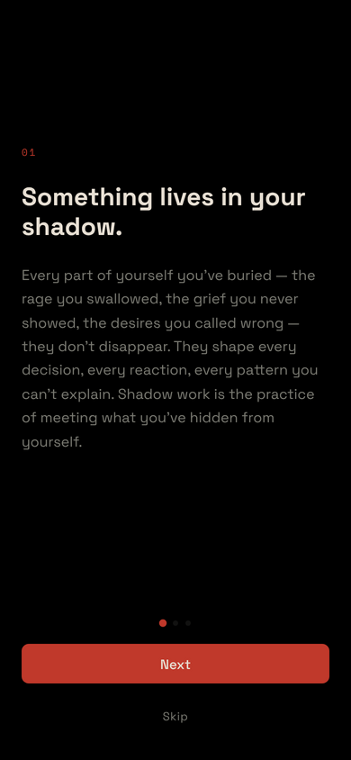
&nbsp;
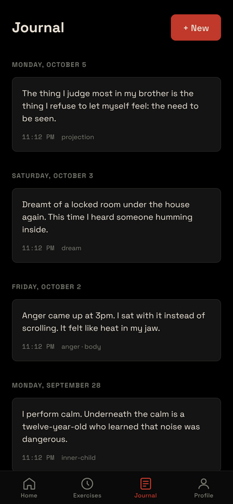
&nbsp;
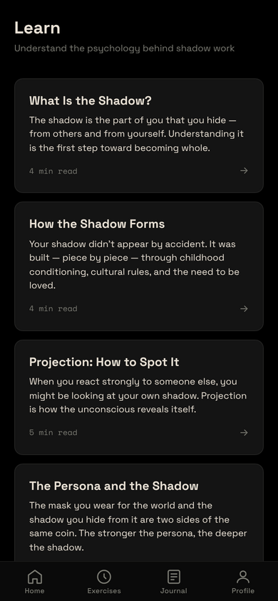
</div>

---

## Privacy is the architecture

What you write here is the material you wouldn't say out loud, so the app is built so that nobody else can ever read it:

- **Everything lives in IndexedDB on your device.** That's all of it.
- **No server. No accounts. No analytics. No telemetry.** There is nothing to breach, because nothing is sent anywhere.
- **Works offline.** Install it as a PWA and it runs with no network at all.
- **Your data is portable.** Export everything to a JSON file and import it on another device.

Your shadow is yours.

---

## A word of care

Shadow work can bring up difficult material. SHADOW is a tool for reflection, **not a substitute for therapy or professional mental-health support.** If you're in crisis, step away from the app and reach out: crisis resources are listed in **Settings**, and in the US you can call or text **988** at any time.

---

## Run it yourself

```bash
git clone https://github.com/ChrisBrooksbank/shadow-work.git
cd shadow-work
npm install
npm run dev        # → http://localhost:5173
```

```bash
npm run build      # typecheck + production build (with service worker)
npm run preview    # serve the production build locally
npm run check      # typecheck, lint, format check, unit tests
npm run test:e2e   # Playwright end-to-end tests
```

Or skip all that: open **[shadow-work-app.netlify.app](https://shadow-work-app.netlify.app)** on your phone and _Add to Home Screen_.

### Built with

**React 19** · **TypeScript** · **Vite** · **Dexie** (IndexedDB) · **Framer Motion** · **CSS Modules** · **vite-plugin-pwa** · **Vitest** · **Playwright**

```
src/
├── pages/        screens: home, check-in, exercises, journal, dreams, triggers, progress, learn
├── components/   shared UI, exercise shell & step renderers, layout
├── data/         exercises, prompts, daily questions, concepts, safety copy
├── db/           Dexie schema, live-query hooks, streak engine
└── hooks/        exercise flow, reminders, install prompt
```

Deployed on Netlify; every push to `main` ships. MIT licensed.

---

<div align="center">

> _"Everything that irritates us about others
> can lead us to an understanding of ourselves."_
>
> — C. G. Jung, _Memories, Dreams, Reflections_

<br />

<sub>Built in the dark. For the dark.</sub>

</div>
